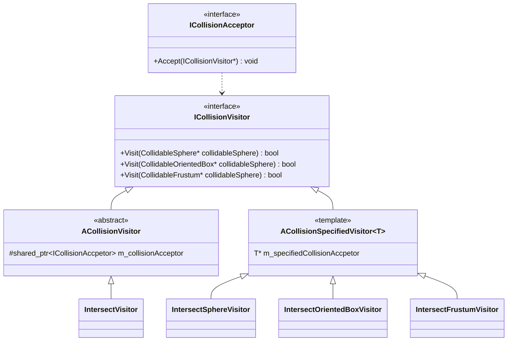

# CollisionManager Library
This CollisionManager Library is for managing colliders used for Game Engine.


## Features
### Dependency
Need `DirectXMath`(and `DirectXCollision`), Header files. 
### Class Structure
CollisionManager 's Class Diagram is Designed in 'ClassDiagram.cd' file.

### ICollisionAcceptor / ACollisionEventReceiver
`ICollisionAcceptor` is an entity designed to determine collisions and is realized into classes such as `CollidableSphere`, `CollidableOrientedBox`, and `CollidableFrustum` inheriting structure from`DirectXCollision`.  The `ACollisionEventReceiver` is an abstract class that works with `ICollisionAcceptor` to handle collision events. This is achieved through the implementation of a pure virtual function:
`virtual void OnCollide(const std::shared_ptr<ACollisionEventReceiver>&) = 0;` 
One critical consideration is that any class inheriting from `ACollisionEventReceiver` must be managed by `std::shared_ptr`.

### Managing Case For Collision
The `CollisionManager` has two methods for checking collisions:
1. Collision detection among **ICollisionAcceptors** within a specific channel.
This identifies collisions between `ICollisionAcceptor` instances registered in the same channel. It can be managed using the following functions:
-   `void CheckAllChannelCollision();`  
    Checks for collisions across all channels.
-   `void CheckChannelCollision(const std::string& channelName);`  
    Checks collisions within a specific channel identified by `channelName`.
  - To register objects for collision checks, the function:
    -   `void RegisterCollidableForChannel(const std::string& channelName, const std::shared_ptr<ICollisionAcceptor>& collidable, const std::shared_ptr<ACollisionEventReceiver>& receiver);`  
    -   `collidable`: The object responsible for collision detection.
    -   `receiver`: The object that handles collision events.
2. Collision detection between *CollisionCheckers* and *CollisionTargets*.
This method handles collision relations, such as the relationship between a camera's *Frustum* and *Objects* in the scene. In this setup, objects (targets) do not interact with one another but are checked for collisions with the *Frustum*. 
It is managed using:
-   `void CheckAllRelationCollision();`  
    Performs collision checks for all defined relations.
-   `void CheckRelationCollision(const std::string& relationName);`  
    Checks collisions for a specific relation defined by `relationName`
- Registration is done with:
  -   `void RegisterCheckerCollidableForRelation(const std::string& channelName, const std::shared_ptr<ICollisionAcceptor>& collisionChecker, const std::shared_ptr<ACollisionEventReceiver>& checkerReceiver);`  
    Registers a *CollisionChecker* object and its corresponding *Event Receiver* for a channel.
  - `void RegisterTargetCollidableForRelation(const std::string& channelName, const std::shared_ptr<ICollisionAcceptor>& collisionTarget, const std::shared_ptr<ACollisionEventReceiver>& targetReceiver);`  
    Registers a *ColiisionTarget* object and its corresponding *Event Receiver* for a channel.

### Double Dispatch For Collision Check
The Double Dispatch design pattern is used to provide an interface for collision detection and minimize dependency. Below is a class diagram to express the structure for Double Dispatch.


There are two `ICollisionAcceptor` objects for collision detection. Let’s call them `Collidable1` and `Collidable2`.  `Collidable1` is the object that initiates the collision detection process through its `Accept` function, while `Collidable2` is wrapped inside an `ACollisionVisitor` and passed to `Collidable1`.

`Collidable1` invokes the `Accept(ICollisionVisitor* collisionVisitor)` method.

```C++
bool CollidableOrientedBox::Accept(ICollisionVisitor& collisionVisitor)
{
	return collisionVisitor.Visit(this);
}
```
This function dynamically executes one of the `Visit` interface methods of `ICollisionVisitor`, based on the type of the `this` pointer at runtime. In this case, 
```C++
bool IntersectVisitor::Visit(CollidableOrientedBox* collidableOrientedBox) const
{
	IntersectOrientedBoxVisitor intersectOrientedBoxVisitor(collidableOrientedBox);
	return m_collisionAcceptor->Accept(intersectOrientedBoxVisitor);
}
```
Subsequently, the concretely typed `ICollisionAcceptor`(Collidable1) is wrapped using `ACollisionSpecifiedVisitor<T>`. This enables a secondary application of the Visitor pattern, allowing the type information of (Collidable2) to be fully resolved during this process.

